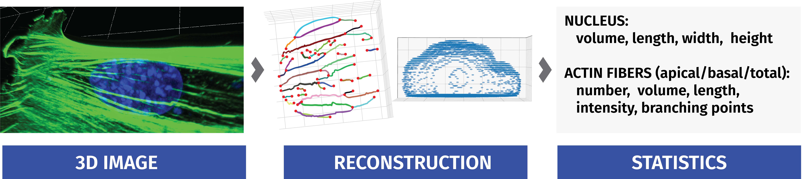
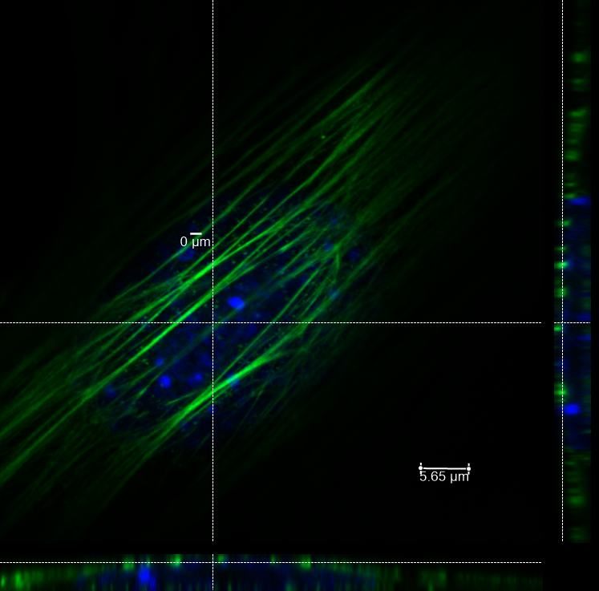
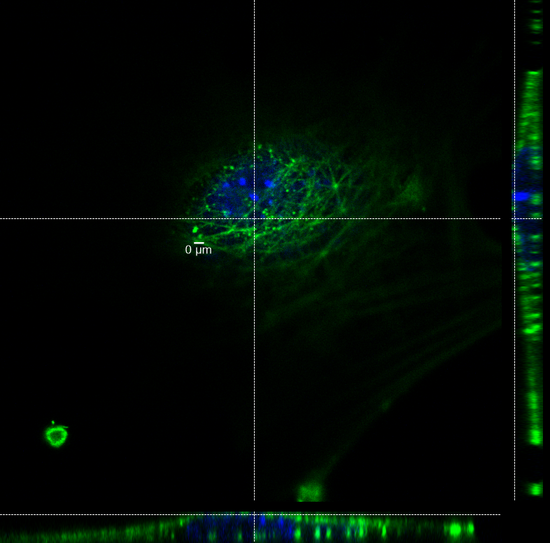

# AFilament
AFilament is an open-source image analysis program designed to analyze confocal microscopy images of cells, specifically for 
the reconstruction of apical and basal actin stress fibers within the nucleus area of Mesenchymal Stem Cells (MSCs) from 3D 
confocal microscope images with fluorescent-labeled actin and nucleus channels. Its primary function is to provide a streamlined 
and automated approach to the analysis of cellular structures by preprocessing confocal microscope images, performing deep 
learning image segmentation, and post-processing the images to extract various features such as nuclei area and actin fibers.

The program takes a confocal microscope 3D image that captures one or multiple cells and outputs aggregated statistics 
for each cell, such as the nucleus volume, length, height, width, intensity, fiber number, length, volume, and intensity 
separately for the apical and basal parts of the cell.



## Image Requirements
AFilament was designed and trained on confocal microscope images of Mesenchymal Stem Cells (MSCs) for the reconstruction of 
apical and basal actin stress fibers within the nucleus area. However, the program can potentially work with other types of cells as well.

It's worth noting that the images used in the development of the program had corresponding resolutions, and for optimal 
performance, it is recommended to use confocal microscope images with similar resolutions, specifically, 
images obtained using 40x and 63x objectives.

<table><tr>
<td>  </td>
<td>  </td>
</tr></table>


## How to use?

### Installation

To install AFilament, first, clone the repository:

```bash
git clone https://github.com/mal-boisestate/afilament.git
```

Then install the required Python packages using pip:
```bash
pip install -r requirements.txt
```
Note that the installation of some packages, such as PyTorch and Bioformats, may require additional steps 
depending on your system configuration

### Usage
After setting the appropriate parameters in  [the configuration file](###Configuration), make the desired changes in main.py, 
save the file, and run it to analyze the desired images. 
The program can be run by executing the main.py file with the following command:
```bash
python main.py
```
Note that you must specify the images to be analyzed by modifying the img_nums variable in main.py. For example, to analyze images 1 through 5, 
set img_nums = range(1, 6).

### Configuration
The program uses a configuration file in JSON format to set various parameters for image analysis. 
Here is an example of a configuration file with comments:
```json
{
  // Path to the directory containing confocal microscope images
  "confocal_img": "D:\\BioLab\\img\\2023.02.14_DAPI_Alexa488_LIV_Experiment\\LIV_sample",
  
  // Index of the channel containing the nuclei stain (0-based)
  "nucleus_channel": 1,
  
  // Index of the channel containing the actin stain (0-based)
  "actin_channel": 0,

  // Path to the pre-trained U-Net model for actin segmentation
  "actin_unet_model": "../unet/models/actin_models_test_file/3_training_set_img_CP_epoch200_W20.pth",
  
  // Path to the pre-trained U-Net model for nucleus segmentation
  "nucleus_unet_model": "../unet/models/CP_epoch200_nucleus_zeiss_plus_6cells_weight_correction_20.pth",
  
  // Path to the pre-trained U-Net model for the nuclei from the top segmentation
  "from_top_nucleus_unet_model": "../unet/models/CP_epoch200_max_pr.pth",
  
  // Image scale factor for the U-Net models
  "unet_model_scale":1,
  
  // Threshold for the U-Net models
  "unet_model_thrh": 0.5,

  // Whether to plot the detected actin fibers
  "is_plot_fibers": false,
  
  // Whether to plot the detected nodes
  "is_plot_nodes": false,
  
  // Whether to auto-normalize the image
  "is_auto_normalized": false,
  
  // Whether to connect the detected actin fibers
  "is_connect_fibers": false,
  
  // Whether to separate the bottom part of the cap from the rest of the image
  "is_separate_cap_bottom": false,
  
  // The ratio of the image height used for separating the cap bottom from the rest of the image
  "cap_bottom_ratio": 0.4,

  // The normalization threshold for the image
  "norm_th": 65536,
  
  // The mode used to find the biggest object in the image
  "find_biggest_mode": "trh",
  
  // The threshold used for nucleus segmentation
  "nuc_theshold": 5,
  
  // The minimum number of pixels required for a nucleus to be considered for further analysis
  "nuc_area_min_pixels_num": 30000,

  // The maximum angle between two consecutive fiber segments in the same fiber
  "fiber_joint_angle": 10,
  
  // The maximum distance between two consecutive fiber segments in the same fiber
  "fiber_joint_distance": 50,
  
  // The minimum number of layers required for a fiber to be considered for further analysis
  "fiber_min_layers_theshold": 40,
  
  // The minimum length required for a fiber to be considered for node detection
  "node_actin_len_th": 2
}


```

### Output Data and Statistic
After the program has completed its run, it saves all statistical files in the "afilament/analysis_data" folder within the program directory. The program output includes the following files:

actin_objects: Contains actin objects that can be visualized using plot_fibers.py script located in the utils folder.
actin_stat: Contains files with actin fiber statistics for each particular cell.
analysis: Contains the analysis_configuration.json file that can be used to track settings that were used for a particular program run and cell_stat.csv file that contains aggregated statistics for the program ran.
The cell_stat.csv file includes the following data for each cell:

- Nucleus volume, in cubic micrometers
- Nucleus length, in micrometers
- Nucleus width, in micrometers
- Nucleus height, in micrometers
- Nucleus total intensity
- Total fiber number
- Total fiber volume, in cubic micrometers
- Total fiber length, in micrometers
- Fiber intensity (whole)
- F-actin signal intensity (whole)
- Nodes total, in number

If the user specifies is_separate_cap_bottom, the following additional data is included in the cell_stat.csv file:

- Apical fiber number
- Apical fiber volume, in cubic micrometers
- Apical fiber length, in micrometers
- Apical intensity (upper part of the cell)
- F-actin signal intensity (apical)
- Nodes apical, in number
- Basal fiber number
- Basal fiber volume, in cubic micrometers
- Basal fiber length, in micrometers
- Basal intensity (bottom part of the cell)
- F-actin signal intensity (basal)
- Nodes basal, in number

### TENSORBOARD
You can visualize in real time the train and test losses, the weights and gradients, along with the model predictions with tensorboard:

tensorboard --logdir=runs

## CREDITS

We used Pytorch-UNet cloned from https://github.com/milesial/Pytorch-UNet by @milesial
*Note from @milesial: Use Python 3.6 or newer*
*Unet usage section was copied from the README file from this repository*


